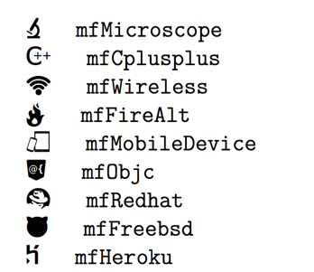
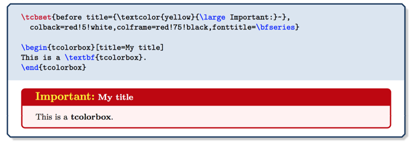

# awesome-ctan

- [Acronyms and other Abbreviations](#acronyms-and-other-abbreviations)
	- [Acro](#acro)
- [Beamer](#beamer)
	- [Metropolis](#metropolis)
- [Color](#color)
	- [xcolor-solarized](#xcolor-solarized)
- [Graphics](#graphics)
	- [asapsym](#asapsym)
	- [bitpattern](#bitpattern)
	- [ccicons](#ccicons)
	- [fontmfizz](#fontmfizz)
	- [flowchart](#flowchart)
	- [mdframed](#mdframed)
	- [register](#register)
	- [marvosym](#marvosym)
	- [pgfgantt](#pgfgantt)
	- [siunitx](#siunitx)
	- [tabu](#tabu)
	- [tcolorbox](#tcolorbox)
- [Page & Layout](#page-&-layout)
	- [bookcover](#bookcover) 
	- [changepage](#changepage)
	- [fancypar](#fancypar)
	- [lastpage](#lastpage)
	- [todonotes](#todonotes)
	- [navigator](#navigator)
	- [pgfornament](#pgfornament)
	- [pgf-soroban](#pgf-soroban)
	- [prerex](#prerex)
	- [typed-checklist](#typed-checklist)
	- [visualpstricks](#visualpstricks)
- [Formatting](#formatting)
	- [latexgit](#latexgit)
	- [listofitems](#listofitems)
	- [paralist](#paralist)
	- [scalerel](#scalerel)
	- [vwcol](#vwcol)
	- [wallpaper](#wallpaper)
- [PDF](#pdf)
	- [pdfpages](#pdfpages)
- [Verbatim](#verbatim)
	- [minted](#minted)
	- [nodetree](#nodetree)
	- [shdoc](#shdoc)
	- [verbments](#verbments)

## Acronyms and other Abbreviations

### Acro
- Typeset Acronyms and other Abbreviations
- https://www.ctan.org/pkg/acro
- 

## Graphics
### asapsym
- symbols contained in the included ASAP Symbol font
- https://www.ctan.org/pkg/asapsym
- 

### bitpattern
- bit pat­tern di­a­grams such as those used to de­scribe hard­ware, data for­mat or pro­to­cols.
- https://www.ctan.org/pkg/bitpattern
- 

### ccicons
- Creative Commons Icons
- https://www.ctan.org/pkg/ccicons
- 

### fontmfizz
- simple font icons
- https://www.ctan.org/pkg/fontmfizz
- 

### flowchart
- for drawing program flowcharts
- https://www.ctan.org/pkg/flowchart
- 

### mdframed
- Framed environments that can split at page boundaries
- https://www.ctan.org/pkg/mdframed
- 

### register
- typesetting the programmable ele- ments in digital hardware
- https://www.ctan.org/pkg/register
- 

### marvosym
- MarVoSym.ttf
- https://www.ctan.org/pkg/marvosym
- 

### pgfgantt
- ganttchart environment, which draws a Gantt chart within a TikZ picture
- https://www.ctan.org/pkg/pgfgantt
- 

### siunitx
- A comprehensive (SI) units package
- https://www.ctan.org/pkg/siunitx
- 

### tabu
- Flexible LATEX tabulars
- https://www.ctan.org/pkg/tabu
- 

### tcolorbox
- Coloured boxes, for LATEX examples and theorems, etc
- https://www.ctan.org/pkg/tcolorbox
- 

## color
### xcolor-solarized
- the sixteen colors of Ethan Schoonover’s popular color palette, Solarized
- https://www.ctan.org/pkg/xcolor-solarized
- 

## Beamer
### Metropolis
- a simple, modern Beamer theme suitable for anyone to use
- https://www.ctan.org/pkg/beamertheme-metropolis

## Page & Layout
### bookcover
- Class for book covers and dust jackets
- https://www.ctan.org/pkg/bookcover
- 

### changepage
- Provides command `\ifoddpage` to detect the current page `side`, environment adjustwidth to locally change the margins of the text, and commands `changetext` and `changepage` for more radical changes to the page design mid-way through a document.
- https://www.ctan.org/pkg/changepage

### fancypar
- five predefined decorative styles for individual text para- graphs of a document
- https://www.ctan.org/pkg/fancypar
- 

### lastpage
- Ref­er­ence the num­ber of pages in your LATEX doc­u­ment
- https://www.ctan.org/pkg/lastpage
- 

### todonotes
- insert to–do items in your docuument
- https://www.ctan.org/pkg/todonotes
- 

### navigator
- access to PDF features such as outlines (book- marks), links, actions and embedded files
- https://www.ctan.org/pkg/navigator

### pgfornament
- Drawing of Vectorian ornaments with PGF/TikZ
- https://www.ctan.org/pkg/pgfornament
- 

### pgf-soroban
- Create images of the soroban using TikZ/PGF(주판)
- https://www.ctan.org/pkg/pgf-soroban
- 

### prerex
- Interactive editor and macro support for prerequisite charts
- https://www.ctan.org/pkg/prerex
- 

### typed-checklist
- Typesetting tasks, goals, milestones, artifacts, and more in LATEX
- https://www.ctan.org/pkg/typed-checklist
- 

### visualpstricks
- Visual help for PSTricks based on images with minimum text
- https://www.ctan.org/pkg/visualpstricks
- 

## Formatting
### latexgit
- sev­eral macros to fetch git in­for­ma­tion and type­set it.
- https://www.ctan.org/pkg/latexgit

### listofitems
- Grab items in lists using user-specified sep char
- https://www.ctan.org/pkg/listofitems

### paralist
- Extended List Environments
- https://www.ctan.org/pkg/paralist

### scalerel
- Constrained scaling and stretching of objects
- https://www.ctan.org/pkg/scalerel
- 

### vwcol
- Variable-width multiple text columns
- https://www.ctan.org/pkg/vwcol
- 

### wallpaper
- Easy addition of wallpapers (background images) to LATEX documents, including tiling
- https://www.ctan.org/pkg/wallpaper

## PDF
### pdfpages
- the insertion of external multi-page PDF or PS documents
- https://www.ctan.org/pkg/pdfpages
- 

## Verbatim
### minted
- Highlighted source code in LATEX
- https://www.ctan.org/pkg/minted
- 

### nodetree
- visualizes the structure of node lists
- https://www.ctan.org/pkg/nodetree
- 

### shdoc
- Float environment to document the shell commands of a terminal session
- https://www.ctan.org/pkg/shdoc
- 

### verbments
- Syntax highlighting of source code in LATEX documents
- https://www.ctan.org/pkg/verbments
- 
